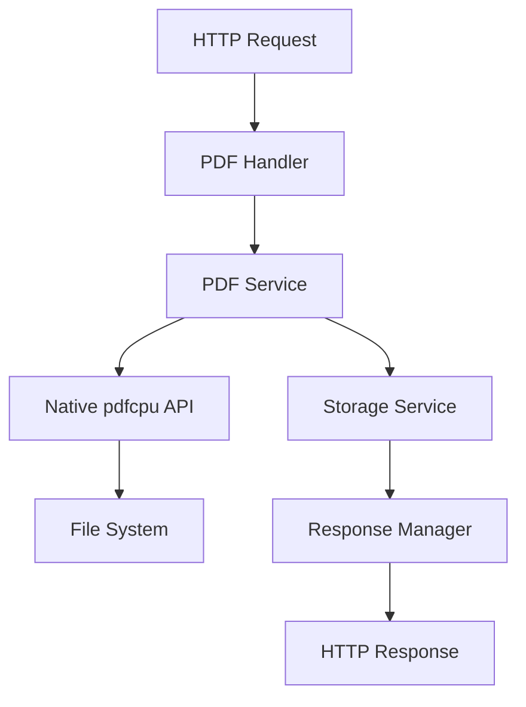
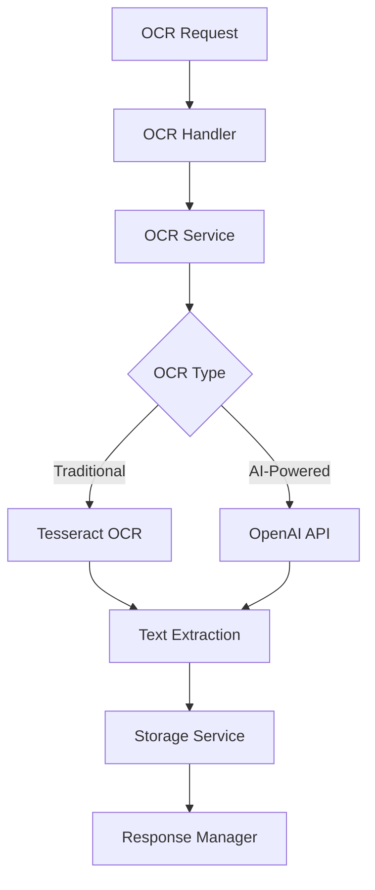
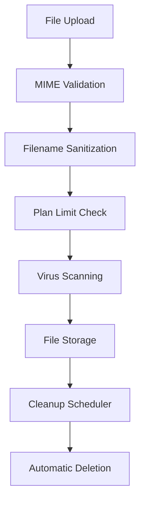

# TuCentroPDF Engine V2 - Architecture Documentation

## 🏗️ System Architecture

TuCentroPDF Engine V2 is built with a modular, microservices-oriented architecture that emphasizes performance, scalability, and maintainability.

## 📋 Table of Contents

- [Overview](#overview)
- [Core Components](#core-components)
- [Service Architecture](#service-architecture)
- [Data Flow](#data-flow)
- [Security Architecture](#security-architecture)
- [Performance Considerations](#performance-considerations)
- [Deployment Architecture](#deployment-architecture)

## 🔍 Overview

### Technology Stack

**Backend Framework:**
- **Go 1.24+** - High-performance, concurrent runtime
- **Fiber v2** - Express-inspired web framework for Go
- **Native pdfcpu** - Pure Go PDF processing library

**PDF Processing:**
- **pdfcpu v0.8.0** - Native Go PDF manipulation
- **Tesseract OCR** - Traditional text recognition
- **OpenAI GPT-4o Vision** - AI-powered OCR and analysis

**Office Processing:**
- **LibreOffice** - Primary office document conversion
- **Gotenberg** - Alternative/fallback conversion service

**Storage & Caching:**
- **Local File System** - Temporary file storage with automatic cleanup
- **Redis** - Caching and session management
- **Plan-based Limits** - Storage quotas by subscription tier

**Monitoring & Logging:**
- **Zap Logger** - Structured, high-performance logging
- **Prometheus** - Metrics collection
- **Grafana** - Monitoring dashboards

## 🏛️ Core Components

### 1. HTTP Server (Fiber)
```
cmd/server/
├── main.go          # Application entry point
├── router.go        # Route definitions and middleware
└── middleware/      # Custom middleware implementations
```

**Responsibilities:**
- HTTP request handling
- Route management
- Middleware execution
- Request/response transformation

### 2. API Layer
```
internal/api/
├── handlers/        # HTTP request handlers
│   ├── handlers.go  # Base handler with unified responses
│   ├── pdf.go       # PDF operation handlers
│   ├── ocr.go       # OCR service handlers
│   ├── office.go    # Office conversion handlers
│   └── storage.go   # File management handlers
├── middleware/      # API middleware
│   ├── auth.go      # Authentication middleware
│   ├── ratelimit.go # Rate limiting
│   └── logging.go   # Request logging
└── routes/          # Route definitions
    └── routes.go    # API route mapping
```

**Responsibilities:**
- Request validation
- Authentication and authorization
- Rate limiting
- Request routing
- Response formatting

### 3. Business Logic Layer
```
internal/
├── pdf/            # PDF processing services
│   └── service.go  # Native pdfcpu integration
├── ocr/            # OCR services
│   ├── service.go  # OCR orchestration
│   ├── tesseract.go # Traditional OCR
│   └── ai.go       # AI-powered OCR
├── office/         # Office document processing
│   ├── service.go  # Conversion orchestration
│   └── libreoffice.go # LibreOffice integration
└── storage/        # File management
    └── service.go  # Storage with plan limits
```

**Responsibilities:**
- Core business logic implementation
- Service orchestration
- External API integration
- Data transformation

### 4. Configuration Management
```
internal/config/
└── config.go       # Application configuration
```

**Responsibilities:**
- Environment variable management
- Configuration validation
- Default value handling

### 5. Shared Utilities
```
pkg/
├── logger/         # Structured logging
│   └── logger.go   # Zap logger implementation
└── response/       # Unified API responses
    └── manager.go  # Response standardization
```

## 🔄 Service Architecture

### PDF Service Architecture



**Key Features:**
- **Native Integration**: Direct pdfcpu API calls (no subprocess execution)
- **Memory Efficiency**: Streaming processing for large files
- **Error Handling**: Comprehensive error capture and logging
- **Performance**: Optimized for concurrent operations

### OCR Service Architecture



**Key Features:**
- **Dual Engine**: Tesseract for basic OCR, GPT-4o Vision for complex documents
- **Plan-based Access**: AI OCR restricted to Premium/Pro plans
- **Quality Control**: Confidence scoring and validation
- **Multi-language Support**: Configurable language packages

### Storage Service Architecture



**Key Features:**
- **Security First**: MIME validation, filename sanitization, virus scanning
- **Plan Enforcement**: Size limits and feature access by subscription tier
- **Automatic Cleanup**: Configurable file retention policies
- **Performance**: Efficient file operations with proper error handling

## 🔄 Data Flow

### 1. Request Processing Flow

```
1. HTTP Request → Fiber Router
2. Authentication Middleware → API Key Validation
3. Rate Limiting → Plan-based Limits
4. Request Handler → Input Validation
5. Service Layer → Business Logic
6. External APIs → PDF/OCR/Office Processing
7. Storage Service → File Management
8. Response Manager → Standardized Response
9. HTTP Response → Client
```

### 2. File Processing Workflow

```
1. File Upload → Multipart Form Processing
2. MIME Detection → Security Validation
3. Plan Validation → Size/Feature Limits
4. Temporary Storage → Secure File Handling
5. Processing Service → PDF/OCR/Office Operations
6. Output Generation → Result File Creation
7. Response Preparation → Download URLs
8. Cleanup Scheduling → Automatic File Removal
```

### 3. Error Handling Flow

```
1. Error Detection → Service Layer
2. Error Classification → Response Manager
3. Logging → Structured Error Logs
4. Response Generation → Standardized Error Format
5. HTTP Response → Client with Error Details
```

## 🔒 Security Architecture

### 1. Authentication & Authorization

```go
// API Key Authentication
type AuthMiddleware struct {
    apiKeys map[string]Plan
    redis   *redis.Client
}

// Rate Limiting by Plan
type RateLimit struct {
    Free:    10 requests/minute
    Premium: 60 requests/minute
    Pro:     300 requests/minute
}
```

### 2. Input Validation

```go
// File Validation Pipeline
func validateFile(file *multipart.FileHeader) error {
    // MIME type validation
    // File size limits
    // Filename sanitization
    // Virus scanning (optional)
}
```

### 3. Data Protection

- **File Encryption**: Optional at-rest encryption
- **Secure Transmission**: HTTPS/TLS for all communications
- **Access Control**: Plan-based feature restrictions
- **Audit Logging**: Complete request/response logging

## ⚡ Performance Considerations

### 1. Concurrency Model

```go
// Go's goroutine-based concurrency
func (s *PDFService) ProcessBatch(files []File) error {
    var wg sync.WaitGroup
    semaphore := make(chan struct{}, 10) // Limit concurrent operations
    
    for _, file := range files {
        wg.Add(1)
        go func(f File) {
            defer wg.Done()
            semaphore <- struct{}{} // Acquire
            defer func() { <-semaphore }() // Release
            
            s.processFile(f)
        }(file)
    }
    
    wg.Wait()
    return nil
}
```

### 2. Memory Management

- **Streaming Processing**: Large files processed in chunks
- **Resource Pooling**: Connection and worker pools
- **Garbage Collection**: Tuned GC settings for Go runtime
- **Memory Limits**: Docker container resource constraints

### 3. Caching Strategy

```go
// Redis Caching
type CacheService struct {
    redis *redis.Client
    ttl   time.Duration
}

// Cache frequently accessed data
// - API key validation results
// - OCR results for duplicate requests
// - File metadata
```

### 4. File I/O Optimization

- **Temporary Storage**: Fast SSD storage for processing
- **Cleanup Automation**: Background cleanup processes
- **Stream Processing**: Avoid loading entire files in memory
- **Compression**: Output file compression when beneficial

## 🚀 Deployment Architecture

### 1. Container Architecture

```dockerfile
# Multi-stage Docker build
FROM golang:1.24-alpine AS builder
# ... build stage

FROM alpine:3.19 AS runtime
# ... runtime dependencies
# - Tesseract OCR with language packs
# - LibreOffice for office conversion
# - Security tools and certificates
```

### 2. Service Composition

```yaml
# docker-compose.yml services
services:
  tucentropdf-engine:  # Main application
    - CPU: 2-4 cores
    - Memory: 2-4GB
    - Storage: SSD preferred
    
  redis:               # Caching layer
    - Memory: 256MB-1GB
    - Persistence: Optional
    
  gotenberg:           # Office conversion fallback
    - CPU: 1-2 cores
    - Memory: 1-2GB
    
  prometheus:          # Monitoring (optional)
  grafana:            # Dashboards (optional)
```

### 3. Networking

```
Internet → Load Balancer/Nginx → Engine (8080)
                              → Redis (6379, internal)
                              → Gotenberg (3000, internal)
                              → Monitoring (9090, 3001)
```

### 4. Storage Layout

```
/app/
├── engine              # Main binary
├── logs/               # Application logs
└── temp/               # Temporary processing files

/tmp/tucentropdf-v2/    # Processing workspace
├── uploads/            # Incoming files
├── processing/         # Work in progress
└── output/             # Generated files
```

## 📊 Monitoring & Observability

### 1. Metrics Collection

- **Application Metrics**: Request counts, response times, error rates
- **System Metrics**: CPU, memory, disk usage
- **Business Metrics**: Plans usage, feature adoption
- **Custom Metrics**: Processing times by operation type

### 2. Logging Strategy

```go
// Structured logging with Zap
logger.Info("PDF processing completed",
    zap.String("operation", "merge"),
    zap.String("requestId", reqID),
    zap.Duration("processingTime", elapsed),
    zap.Int("inputFiles", len(files)),
    zap.String("outputFile", result.Filename),
)
```

### 3. Health Checks

```go
// Health check endpoint
type HealthStatus struct {
    Status    string            `json:"status"`
    Version   string            `json:"version"`
    Timestamp time.Time         `json:"timestamp"`
    Services  map[string]string `json:"services"`
    Uptime    int64            `json:"uptime"`
}
```

## 🔄 Scalability Considerations

### 1. Horizontal Scaling

- **Stateless Design**: No server-side session state
- **Load Balancing**: Round-robin or least-connections
- **Shared Storage**: Redis for cross-instance data
- **Auto-scaling**: Container orchestration support

### 2. Performance Optimization

- **Connection Pooling**: Database and external service connections
- **Request Batching**: Batch similar operations when possible
- **Async Processing**: Background job processing for large operations
- **CDN Integration**: Static asset delivery optimization

### 3. Resource Management

- **Memory Limits**: Prevent memory leaks and OOM conditions
- **CPU Limits**: Fair resource allocation
- **I/O Throttling**: Disk and network bandwidth management
- **Cleanup Automation**: Automatic resource reclamation

This architecture provides a robust foundation for high-performance PDF processing with enterprise-grade reliability, security, and scalability.