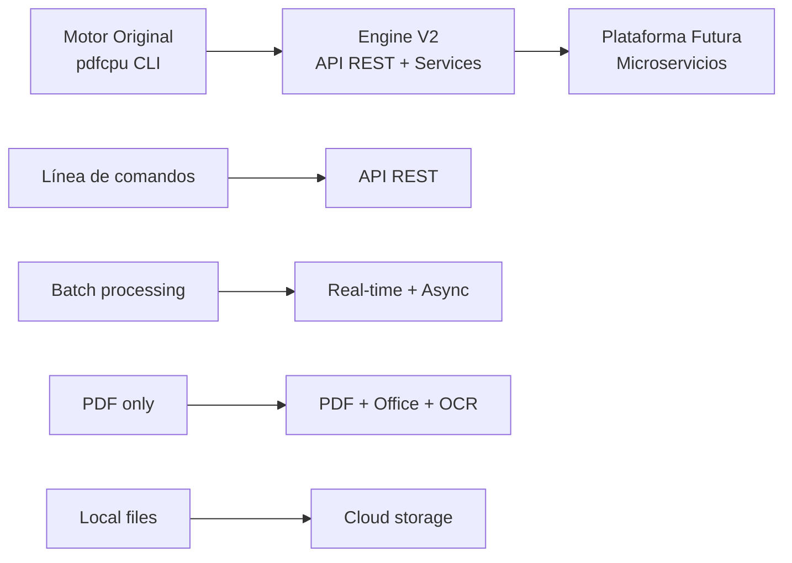
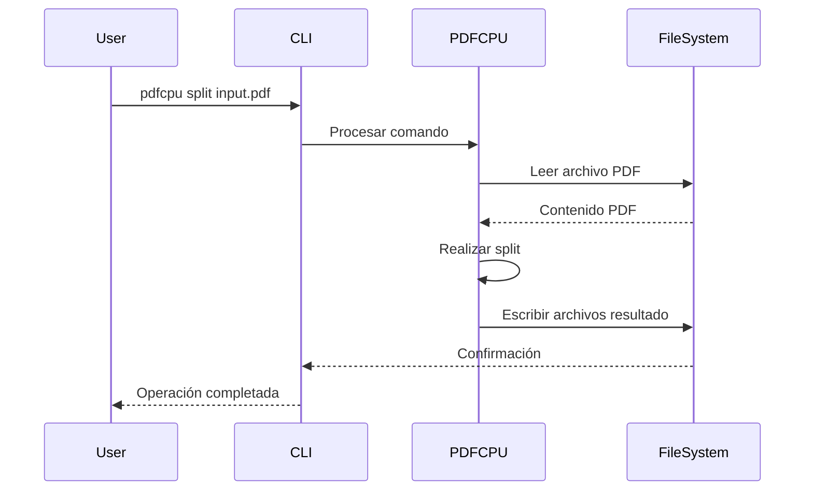
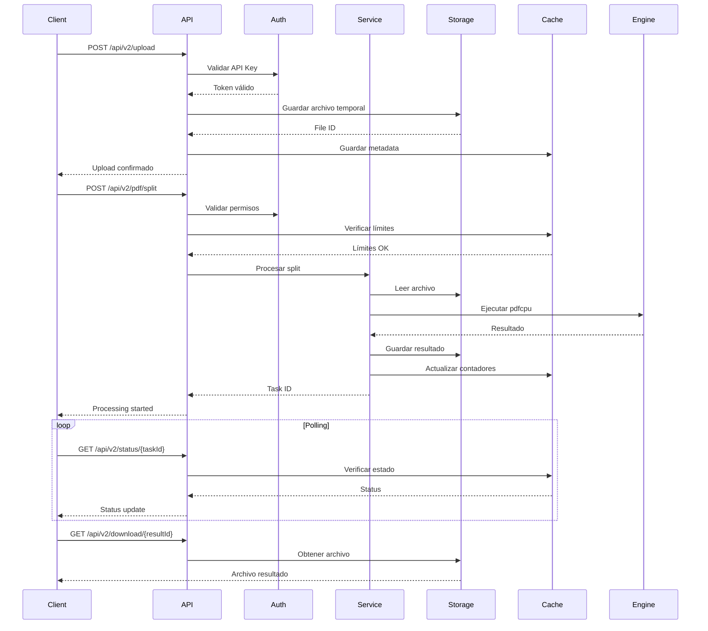
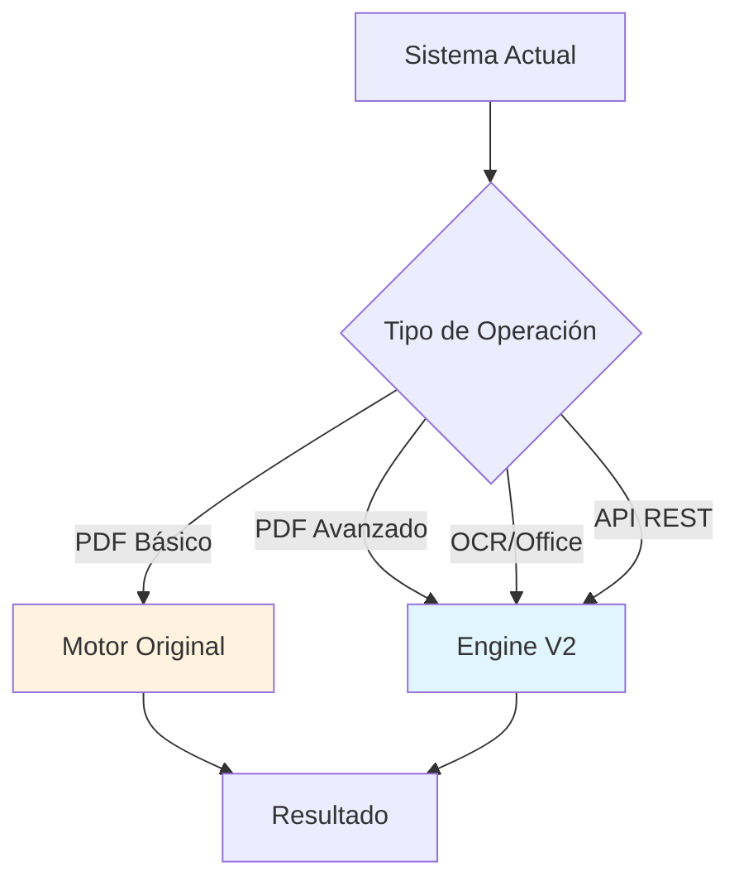
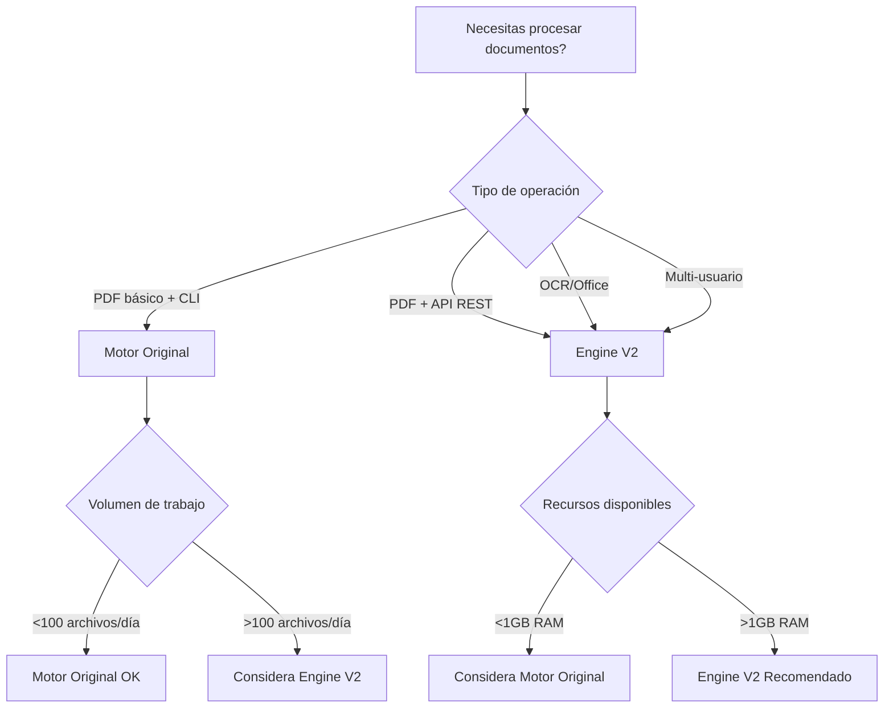

# 🏗️ Arquitectura Completa TuCentroPDF
## Motor Original vs Engine V2

---

## 📋 Índice
- [Resumen Ejecutivo](#resumen-ejecutivo)
- [Motor Original (pdfcpu)](#motor-original-pdfcpu)
- [Engine V2 (Nuevo)](#engine-v2-nuevo)
- [Comparativa Técnica](#comparativa-técnica)
- [Migración y Coexistencia](#migración-y-coexistencia)
- [Casos de Uso](#casos-de-uso)
- [Roadmap Tecnológico](#roadmap-tecnológico)

---

## 🎯 Resumen Ejecutivo

### Vision General
TuCentroPDF ha evolucionado de un motor básico de procesamiento PDF (basado en pdfcpu) a una plataforma completa de procesamiento de documentos con capacidades empresariales.

### Evolución Arquitectónica


---

## 🔧 Motor Original (pdfcpu)

### Arquitectura Monolítica
```
┌─────────────────────────────────────────┐
│           Motor Original (pdfcpu)        │
├─────────────────────────────────────────┤
│                                         │
│  ┌─────────────┐  ┌─────────────┐       │
│  │   cmd/      │  │ internal/   │       │
│  │             │  │             │       │
│  │ ┌─────────┐ │  │ ┌─────────┐ │       │
│  │ │  main   │ │  │ │corefont │ │       │
│  │ │  init   │ │  │ │         │ │       │
│  │ │ usage   │ │  │ └─────────┘ │       │
│  │ │process  │ │  │             │       │
│  │ │  cmd    │ │  │             │       │
│  │ └─────────┘ │  │             │       │
│  └─────────────┘  └─────────────┘       │
│                                         │
│  ┌─────────────────────────────────────┐ │
│  │           pkg/                      │ │
│  │                                     │ │
│  │ ┌─────┐ ┌─────┐ ┌─────┐ ┌─────────┐ │ │
│  │ │ api │ │ cli │ │font │ │ pdfcpu  │ │ │
│  │ │     │ │     │ │     │ │         │ │ │
│  │ └─────┘ └─────┘ └─────┘ └─────────┘ │ │
│  │                                     │ │
│  │ ┌─────┐ ┌─────┐ ┌─────┐ ┌─────────┐ │ │
│  │ │filter│ │ log │ │sample│ │testdata │ │ │
│  │ │     │ │     │ │     │ │         │ │ │
│  │ └─────┘ └─────┘ └─────┘ └─────────┘ │ │
│  └─────────────────────────────────────┘ │
└─────────────────────────────────────────┘
```

### Características del Motor Original

#### ✅ **Fortalezas:**
- **Rendimiento**: Escrito en Go, muy rápido para operaciones PDF
- **Estabilidad**: Biblioteca madura y probada
- **Funcionalidades PDF**: Amplio conjunto de operaciones PDF nativas
- **Simplicidad**: API directa y fácil de usar
- **Memoria**: Eficiente en uso de memoria para archivos grandes

#### ❌ **Limitaciones:**
- **Solo PDF**: No puede procesar Office, imágenes, etc.
- **No API REST**: Solo interfaz de línea de comandos
- **No OCR**: Sin capacidades de reconocimiento de texto
- **No escalabilidad**: Diseño monolítico
- **No estado**: Sin persistencia de datos o cache
- **No autenticación**: Sin sistema de seguridad integrado

#### 🛠️ **Flujo de Trabajo Original:**


---

## 🚀 Engine V2 (Nuevo)

### Arquitectura de Microservicios
```
┌─────────────────────────────────────────────────────────────────────┐
│                         TuCentroPDF Engine V2                      │
├─────────────────────────────────────────────────────────────────────┤
│                                                                     │
│  ┌─────────────────┐  ┌─────────────────┐  ┌─────────────────┐     │
│  │   API Gateway   │  │   Load Balancer │  │  Reverse Proxy  │     │
│  │   (Nginx)       │  │   (Docker)      │  │   (SSL/TLS)     │     │
│  └─────────────────┘  └─────────────────┘  └─────────────────┘     │
│            │                     │                     │           │
│  ┌─────────────────────────────────────────────────────────────┐   │
│  │                    API Layer                               │   │
│  │                                                            │   │
│  │  ┌─────────────┐  ┌─────────────┐  ┌─────────────┐        │   │
│  │  │ REST API    │  │ Middleware  │  │ Validation  │        │   │
│  │  │ (Gin)       │  │ (Auth/CORS) │  │ (Schema)    │        │   │
│  │  └─────────────┘  └─────────────┘  └─────────────┘        │   │
│  └─────────────────────────────────────────────────────────────┘   │
│            │                     │                     │           │
│  ┌─────────────────────────────────────────────────────────────┐   │
│  │                 Service Layer                              │   │
│  │                                                            │   │
│  │  ┌─────────────┐  ┌─────────────┐  ┌─────────────┐        │   │
│  │  │ PDF Service │  │ OCR Service │  │Office Service│        │   │
│  │  │             │  │ (Tesseract) │  │ (LibreOffice)│        │   │
│  │  │ ┌─────────┐ │  │ ┌─────────┐ │  │ ┌─────────┐ │        │   │
│  │  │ │ pdfcpu  │ │  │ │AI Models│ │  │ │Converter│ │        │   │
│  │  │ │Enhanced │ │  │ │Multi-Lang││ │ │ │Pipeline │ │        │   │
│  │  │ └─────────┘ │  │ └─────────┘ │  │ └─────────┘ │        │   │
│  │  └─────────────┘  └─────────────┘  └─────────────┘        │   │
│  └─────────────────────────────────────────────────────────────┘   │
│            │                     │                     │           │
│  ┌─────────────────────────────────────────────────────────────┐   │
│  │                 Storage Layer                              │   │
│  │                                                            │   │
│  │  ┌─────────────┐  ┌─────────────┐  ┌─────────────┐        │   │
│  │  │File Storage │  │Cache Layer  │  │ Metadata    │        │   │
│  │  │(Local/Cloud)│  │ (Redis)     │  │ (JSON/DB)   │        │   │
│  │  └─────────────┘  └─────────────┘  └─────────────┘        │   │
│  └─────────────────────────────────────────────────────────────┘   │
│            │                     │                     │           │
│  ┌─────────────────────────────────────────────────────────────┐   │
│  │              Infrastructure Layer                          │   │
│  │                                                            │   │
│  │  ┌─────────────┐  ┌─────────────┐  ┌─────────────┐        │   │
│  │  │ Monitoring  │  │   Logging   │  │   Security  │        │   │
│  │  │(Prometheus) │  │(Structured) │  │(JWT/API Key)│        │   │
│  │  └─────────────┘  └─────────────┘  └─────────────┘        │   │
│  └─────────────────────────────────────────────────────────────┘   │
└─────────────────────────────────────────────────────────────────────┘
```

### Estructura Detallada del Engine V2

#### 🎯 **API Layer**
```
cmd/server/
├── main.go              # Punto de entrada
├── routes.go            # Definición de rutas
├── middleware.go        # Middleware personalizado
└── config.go           # Configuración del servidor

internal/api/
├── handlers/           # Controladores HTTP
│   ├── pdf.go         # Endpoints PDF
│   ├── ocr.go         # Endpoints OCR
│   ├── office.go      # Endpoints Office
│   └── health.go      # Health checks
├── middleware/        # Middleware de aplicación
│   ├── auth.go       # Autenticación
│   ├── cors.go       # CORS
│   ├── ratelimit.go  # Rate limiting
│   └── logging.go    # Logging
└── responses/         # Estructuras de respuesta
    ├── success.go
    ├── error.go
    └── pagination.go
```

#### ⚙️ **Service Layer**
```
internal/
├── pdf/              # Servicio PDF (Enhanced pdfcpu)
│   ├── service.go    # Lógica de negocio PDF
│   ├── operations.go # Operaciones específicas
│   ├── validator.go  # Validaciones PDF
│   └── converter.go  # Conversiones
├── ocr/              # Servicio OCR
│   ├── service.go    # Lógica OCR
│   ├── tesseract.go  # Integración Tesseract
│   ├── preprocessor.go # Preprocesamiento
│   └── models.go     # Modelos de IA
├── office/           # Servicio Office
│   ├── service.go    # Lógica Office
│   ├── libreoffice.go # Integración LibreOffice
│   ├── converter.go  # Pipeline conversión
│   └── formats.go    # Formatos soportados
├── storage/          # Gestión de almacenamiento
│   ├── local.go      # Almacenamiento local
│   ├── cloud.go      # Almacenamiento en nube
│   ├── cache.go      # Cache Redis
│   └── cleanup.go    # Limpieza automática
└── config/           # Configuración
    ├── config.go     # Configuración global
    ├── env.go        # Variables entorno
    └── validation.go # Validación config
```

#### 🗄️ **Storage & Cache Layer**
```
storage/
├── uploads/          # Archivos temporales
├── results/          # Resultados procesados
├── cache/           # Cache de archivos
└── logs/            # Logs de aplicación

Redis Cache:
├── file_metadata    # Metadatos de archivos
├── processing_jobs  # Jobs en progreso
├── rate_limits     # Contadores rate limiting
└── user_sessions   # Sesiones de usuario
```

### 🔄 **Flujo de Trabajo Engine V2**

#### Flujo Completo de Procesamiento:


---

## ⚖️ Comparativa Técnica

### 📊 Tabla Comparativa

| Aspecto | Motor Original | Engine V2 |
|---------|---------------|-----------|
| **Arquitectura** | Monolítica CLI | Microservicios API |
| **Tecnología** | Go puro | Go + Redis + Nginx |
| **Interfaz** | Línea de comandos | API REST + Web |
| **Tipos de archivo** | Solo PDF | PDF + Office + Imágenes |
| **OCR** | ❌ No | ✅ Tesseract + IA |
| **Autenticación** | ❌ No | ✅ JWT + API Keys |
| **Rate Limiting** | ❌ No | ✅ Configurable |
| **Cache** | ❌ No | ✅ Redis |
| **Monitoreo** | ❌ No | ✅ Prometheus + Logs |
| **Escalabilidad** | Vertical | Horizontal |
| **Deployment** | Manual | Docker + CI/CD |
| **Testing** | Básico | Suite completa |
| **Documentación** | Básica | Completa + API docs |

### 🚀 Mejoras de Rendimiento

#### Motor Original:
```go
// Operación simple
func SplitPDF(inputPath string, outputDir string) error {
    return pdfcpu.SplitFile(inputPath, outputDir, 1, nil)
}
```

#### Engine V2:
```go
// Operación con cache, validación y monitoreo
func (s *PDFService) SplitPDF(ctx context.Context, req *SplitRequest) (*TaskResponse, error) {
    // 1. Validación
    if err := s.validator.ValidateSplitRequest(req); err != nil {
        return nil, err
    }
    
    // 2. Cache check
    if cached := s.cache.GetCachedResult(req.FileID, "split", req.Options); cached != nil {
        return cached, nil
    }
    
    // 3. Rate limiting
    if err := s.rateLimiter.Allow(req.UserID); err != nil {
        return nil, err
    }
    
    // 4. Async processing
    taskID := s.taskManager.CreateTask(req.UserID, "pdf_split")
    
    go func() {
        defer s.monitoring.RecordOperation("pdf_split", time.Now())
        
        result, err := s.processSplit(req)
        if err != nil {
            s.taskManager.SetError(taskID, err)
            return
        }
        
        // 5. Cache result
        s.cache.SetResult(req.FileID, "split", req.Options, result)
        s.taskManager.SetCompleted(taskID, result)
    }()
    
    return &TaskResponse{TaskID: taskID}, nil
}
```

### 💾 Uso de Recursos

#### Motor Original:
- **RAM**: 50-200MB para archivos grandes
- **CPU**: Un solo core durante procesamiento
- **Disco**: Archivos temporales sin gestión
- **Red**: No aplicable (local)

#### Engine V2:
- **RAM**: 100-500MB (incluye cache Redis)
- **CPU**: Multi-core con workers concurrentes
- **Disco**: Gestión automática con cleanup
- **Red**: Optimizado para múltiples conexiones concurrentes
- **Cache**: Redis 50-100MB para metadata

---

## 🔄 Migración y Coexistencia

### Estrategias de Migración

#### 1. **Migración Gradual (Recomendada)**


#### 2. **Wrapper de Compatibilidad**
```go
// Wrapper que permite usar ambos motores
type UnifiedPDFProcessor struct {
    originalEngine *pdfcpu.Engine
    newEngine      *v2.Engine
    config         *Config
}

func (u *UnifiedPDFProcessor) ProcessPDF(operation string, file string, options map[string]interface{}) error {
    // Decide qué motor usar basado en la operación y configuración
    if u.shouldUseV2(operation, options) {
        return u.newEngine.Process(operation, file, options)
    }
    return u.originalEngine.Process(operation, file, options)
}

func (u *UnifiedPDFProcessor) shouldUseV2(operation string, options map[string]interface{}) bool {
    // Usar V2 para operaciones avanzadas
    advancedOps := []string{"ocr", "office_convert", "batch_process", "api_request"}
    
    for _, op := range advancedOps {
        if operation == op {
            return true
        }
    }
    
    // Usar V2 si se requieren features específicas
    if _, hasAsync := options["async"]; hasAsync {
        return true
    }
    
    if _, hasAuth := options["user_id"]; hasAuth {
        return true
    }
    
    return u.config.PreferV2
}
```

### 📋 Plan de Migración

#### **Fase 1: Preparación (Semana 1)**
- ✅ Configurar Engine V2 en paralelo
- ✅ Migrar configuraciones
- ✅ Setup de monitoreo
- ✅ Testing de compatibilidad

#### **Fase 2: Migración Parcial (Semanas 2-3)**
```bash
# Configuración dual
ENABLE_DUAL_MODE=true
PREFER_V2_FOR="ocr,office,api,batch"
FALLBACK_TO_V1="true"
LOG_MIGRATION_DECISIONS="true"
```

#### **Fase 3: Migración Completa (Semana 4)**
```bash
# Solo Engine V2
ENABLE_DUAL_MODE=false
USE_ENGINE_V2_ONLY=true
DEPRECATE_V1_ENDPOINTS=true
```

#### **Fase 4: Limpieza (Semana 5)**
- 🧹 Remover código del motor original
- 🧹 Cleanup de dependencias no utilizadas
- 🧹 Optimizar configuración final

---

## 🎯 Casos de Uso

### Motor Original - Casos Ideales
```yaml
Casos de Uso del Motor Original:
  - name: "Procesamiento batch simple"
    description: "Scripts que procesan muchos PDFs de manera secuencial"
    example: "pdfcpu split *.pdf"
    
  - name: "Operaciones PDF básicas"
    description: "Split, merge, rotate sin necesidad de API"
    example: "pdfcpu merge output.pdf input1.pdf input2.pdf"
    
  - name: "Integración CLI"
    description: "Scripts bash/shell que requieren herramienta CLI"
    example: "for file in *.pdf; do pdfcpu optimize $file; done"
    
  - name: "Recursos limitados"
    description: "Sistemas con poca RAM donde simplicidad es clave"
    memory: "50-100MB"
```

### Engine V2 - Casos Ideales
```yaml
Casos de Uso del Engine V2:
  - name: "Aplicaciones web"
    description: "APIs REST para aplicaciones frontend"
    example: "POST /api/v2/pdf/split"
    
  - name: "Procesamiento avanzado"
    description: "OCR, conversión Office, operaciones complejas"
    example: "OCR de documentos escaneados con IA"
    
  - name: "Sistemas empresariales"
    description: "Autenticación, limits, monitoreo, auditoría"
    features: ["JWT auth", "Rate limiting", "Logs detallados"]
    
  - name: "Escalabilidad"
    description: "Múltiples usuarios concurrentes"
    capacity: "100+ requests/second"
    
  - name: "Integración moderna"
    description: "Microservicios, Docker, CI/CD"
    deployment: "Kubernetes, Docker Swarm"
```

### Matriz de Decisión


---

## 🛣️ Roadmap Tecnológico

### 2024 Q4 - Estado Actual ✅
- ✅ Engine V2 completamente funcional
- ✅ API REST completa
- ✅ OCR con Tesseract
- ✅ Conversión Office
- ✅ Sistema de autenticación
- ✅ Deployment automatizado

### 2025 Q1 - Optimizaciones 🔄
- 🔄 **Performance tuning**
- 🔄 **Cache distribuido**
- 🔄 **Monitoring avanzado**
- 🔄 **Load balancing**

### 2025 Q2 - Funcionalidades Avanzadas 📋
- 📋 **Dashboard de administración**
- 📋 **Webhooks y notificaciones**
- 📋 **Processing pipeline visual**
- 📋 **Multi-tenant architecture**

### 2025 Q3 - AI/ML Integration 🤖
- 🤖 **OCR con modelos propios**
- 🤖 **Clasificación automática de documentos**
- 🤖 **Extracción inteligente de datos**
- 🤖 **Análisis de contenido**

### 2025 Q4 - Platform Evolution 🚀
- 🚀 **Microservicios distribuidos**
- 🚀 **Kubernetes native**
- 🚀 **API Gateway avanzado**
- 🚀 **Event-driven architecture**

---

## 🔧 Configuración de Convivencia

### Docker Compose - Dual Mode
```yaml
version: '3.8'
services:
  # Motor Original (CLI wrapper)
  pdfcpu-original:
    build:
      context: .
      dockerfile: Dockerfile.original
    volumes:
      - ./uploads:/app/uploads
      - ./results:/app/results
    environment:
      - MODE=original
    
  # Engine V2
  tucentropdf-v2:
    build:
      context: ./engine_v2
      dockerfile: Dockerfile
    ports:
      - "8080:8080"
    environment:
      - APP_ENV=production
      - DUAL_MODE=true
      - FALLBACK_ENGINE=pdfcpu-original
    depends_on:
      - redis
      - pdfcpu-original
    
  # Router que decide qué motor usar
  smart-router:
    image: nginx:alpine
    ports:
      - "80:80"
      - "443:443"
    volumes:
      - ./nginx/smart-routing.conf:/etc/nginx/nginx.conf
    depends_on:
      - tucentropdf-v2
      - pdfcpu-original
```

### Nginx Smart Routing
```nginx
upstream engine_v2 {
    server tucentropdf-v2:8080;
}

upstream engine_original {
    server pdfcpu-original:8081;
}

server {
    listen 80;
    
    # API REST -> Engine V2
    location /api/ {
        proxy_pass http://engine_v2;
    }
    
    # OCR/Office -> Engine V2
    location ~ ^/(ocr|office)/ {
        proxy_pass http://engine_v2;
    }
    
    # CLI legacy -> Original (if wrapped)
    location /cli/ {
        proxy_pass http://engine_original;
    }
    
    # Default -> Engine V2
    location / {
        proxy_pass http://engine_v2;
    }
}
```

---

## 📈 Métricas y Monitoreo

### Comparativa de Rendimiento
```yaml
Benchmarks (Archivo PDF 10MB, 100 páginas):

Motor Original:
  split: 2.3s
  merge: 1.8s
  optimize: 4.2s
  memoria: 85MB
  
Engine V2:
  split: 2.1s (con cache: 0.1s)
  merge: 1.6s (con cache: 0.1s)  
  optimize: 3.8s (con cache: 0.1s)
  ocr: 12.5s
  office_convert: 8.3s
  memoria: 145MB (sin cache), 180MB (con cache)
  
Escalabilidad:
  Motor Original: 1 operación a la vez
  Engine V2: 50+ operaciones concurrentes
```

### Dashboard de Monitoreo
```yaml
Métricas Clave:
  Performance:
    - Tiempo de respuesta por operación
    - Throughput (ops/segundo)
    - Uso de CPU/RAM
    - Cache hit rate
    
  Business:
    - Archivos procesados
    - Usuarios activos
    - Tipos de operación más usados
    - Errores por tipo
    
  Infrastructure:
    - Estado de servicios
    - Uso de disco
    - Conexiones de red
    - Estado de cache Redis
```

---

## 🔚 Conclusión

### Recomendaciones Finales

#### **Para Proyectos Nuevos:**
- ✅ **Usar Engine V2** desde el inicio
- ✅ Aprovechar todas las funcionalidades avanzadas
- ✅ Implementar con Docker y CI/CD

#### **Para Proyectos Existentes:**
- 🔄 **Migración gradual** con dual mode
- 🔄 Mantener motor original para operaciones críticas durante transición
- 🔄 Migrar completamente cuando sea estable

#### **Para Casos Específicos:**
- 🎯 **CLI simple**: Motor original suficiente
- 🎯 **API/Web**: Engine V2 obligatorio
- 🎯 **OCR/Office**: Solo Engine V2
- 🎯 **Empresa**: Engine V2 con todas las funcionalidades

### Filosofía de Desarrollo

> **"Evolución sin revolución"** - El Engine V2 no reemplaza brutalmente el motor original, sino que lo evoluciona manteniendo compatibilidad y agregando capacidades modernas para satisfacer las necesidades actuales de procesamiento de documentos a escala empresarial.

---

**📊 TuCentroPDF: De herramienta simple a plataforma empresarial** 🚀